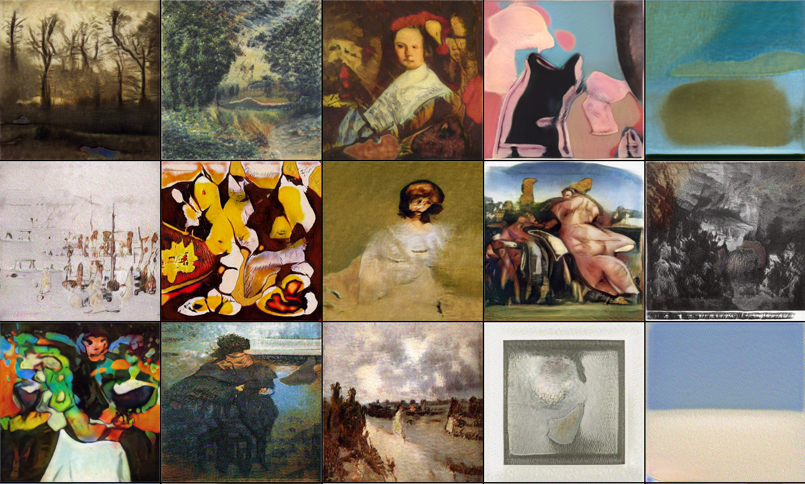
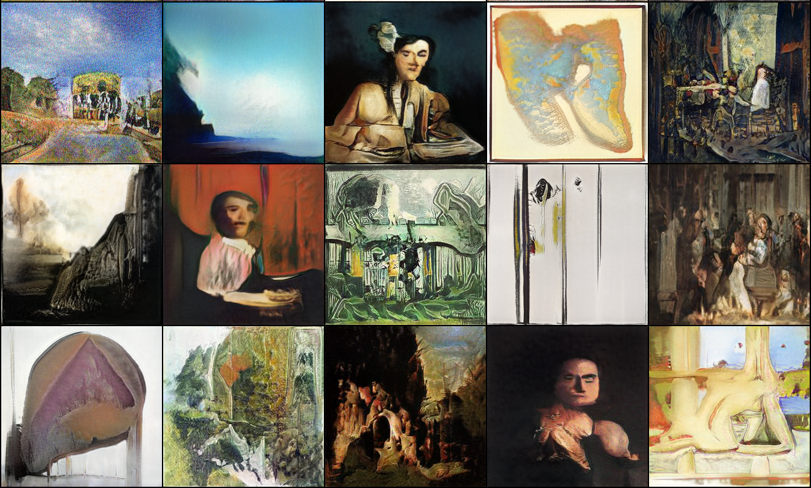

# Wölfflin Affective Generative Analysis

This repo contains the code for implementation of StyleCAN1 and StyleCAN2 models proposed in the paper Wölfflin Affective Generative Analysis for Visual Art published in International Conference on Computational Creativity (ICCC) 2021.
The implementations for StyleGAN1 and StyleGAN2 models are taken from [rosinality/style-based-gan-pytorch](https://github.com/rosinality/style-based-gan-pytorch) and [rosinality/stylegan2-pytorch](https://github.com/rosinality/stylegan2-pytorch) respectively.

## Requirements

- PyTorch
- torchvision
- CUDA 10.1/10.2
- numpy
- scipy
- matplotlib
- pandas
- pillow
  
## Usage

First download the wikiart dataset from [here](https://www.dropbox.com/s/ssw0fdcdld50o1g/wikiartimages.zip/).

Extract the data in the root directory.

### StyleCAN1
To train StyleCAN1.

```bash
cd StyleCAN1
python -u train.py\
        --sched\
        --max_size=256\
        --use_CAN\
```

### StyleCAN2
To train StyleCAN2.

```bash
cd StyleCAN2
python -m torch.distributed.launch --nproc_per_node=4 --master_port=12895 train.py\
        --batch=32\
        --n_sample=25\
        --size=256\
        --use_CAN\
```

### Run analysis

To run analysis notebooks, first download precomputed features on generated and real images from [here](). Extract the features in `analyses_notebooks/datasets/features`. This file is only required to run the `get_best_correlation_coefficients_for_wofflin_principle.ipynb`. Other analysis notebooks can be run without downloading these features. In your terminal change your directory to the root folder of this project and start jupyter server using

`jupyter notebook`

Navigate to `analyses_notebooks` path and run the notebook of your choice.

## Sample Results

### StyleCAN1



### StyleCAN2




